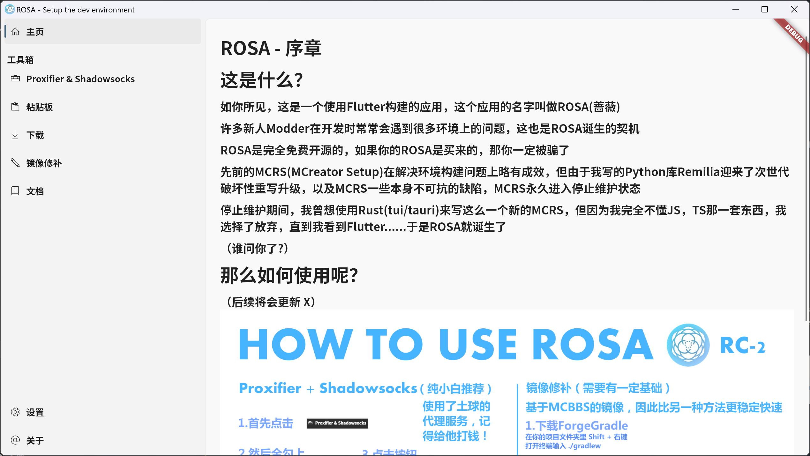
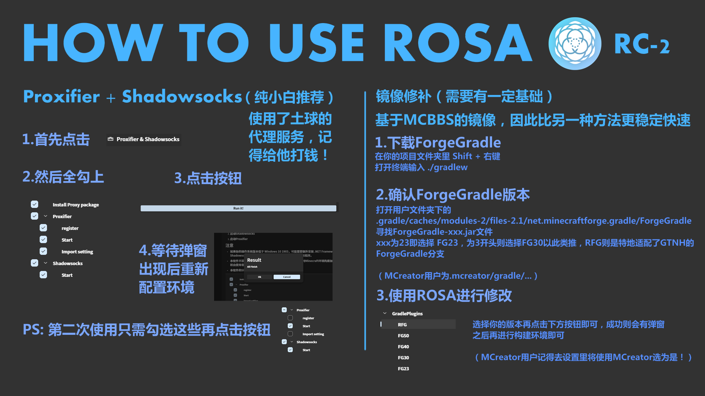

# 何为Rosa

Rosa是一款用于加速构建的工具箱，前身为MCreatorSetup，使用Dart重构并改为GUI应用

# 功能速览

 - 一键配置Proxifier（使用土球的代理服务器）
 - 修补ForgeGradle（替换为mcbbs的maven与assets）
 - mclogs粘贴板
 - MCreator专用配置JDK

# 截图

# 快速上手

# 下载

https://github.com/H2Sxxa/Rosa/releases/latest

# 所有参与Rosa的开发人员（不包含分支）

# 鸣谢（不分先后）

 - [cdc12345](https://github.com/cdc12345) - 参与镜像修补开发
 - [ZekerZhayard](https://github.com/ZekerZhayard) - MCreatorSetup重要实现协助者，镜像修补灵感启发与他的[mirror.gradle](https://github.com/IdeallandEarthDept/IdeallandFramework/blob/master/mirror.gradle)
 - [fluent_ui](https://github.com/bdlukaa/fluent_ui) - 本应用使用的UI库
 - [THBwiki](https://thwiki.cc/) - 应用图标改自THBwiki图标
 - [7-zip](https://thwiki.cc/) - Jar注入class工具
 - 所有使用Rosa的用户

